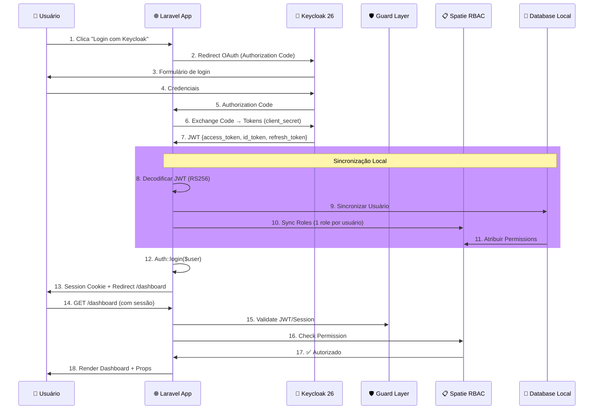
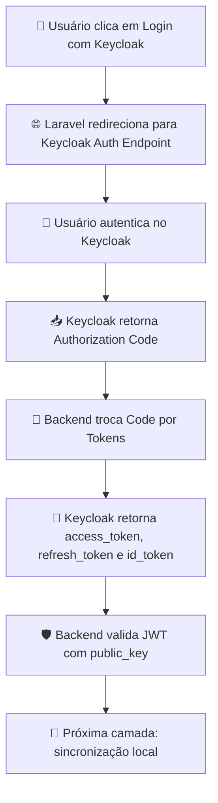
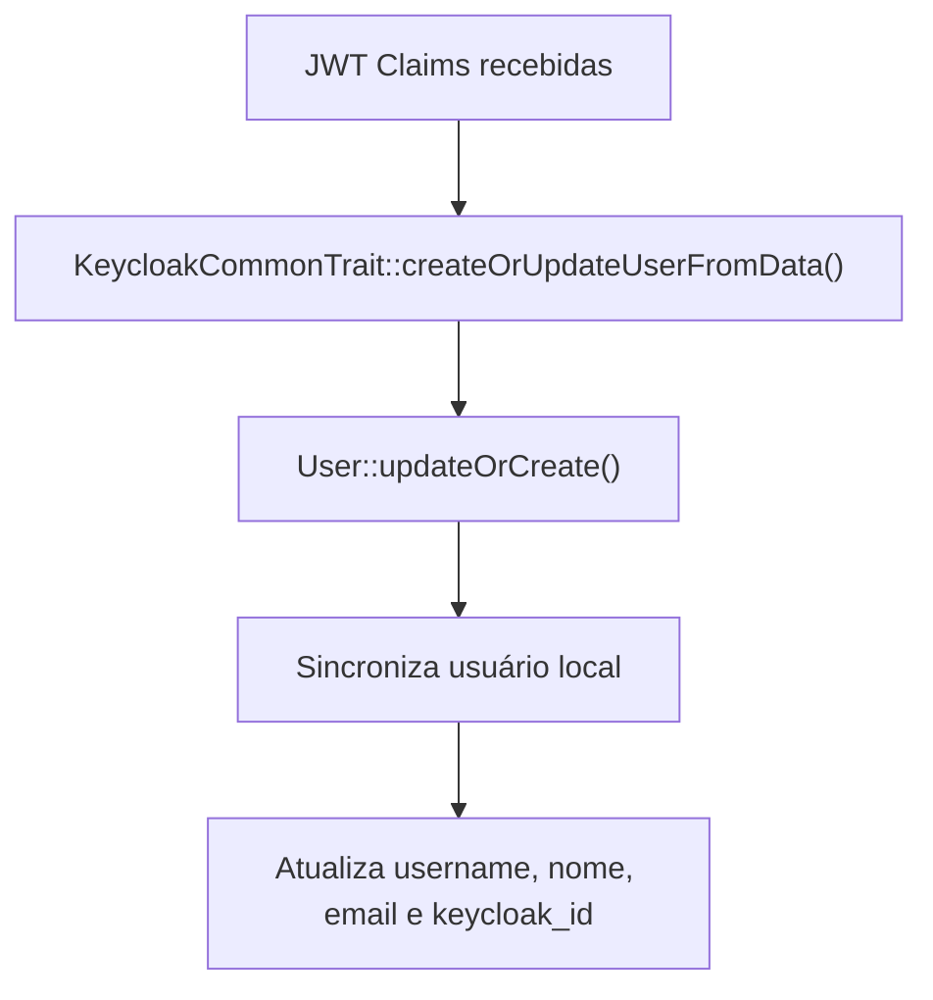
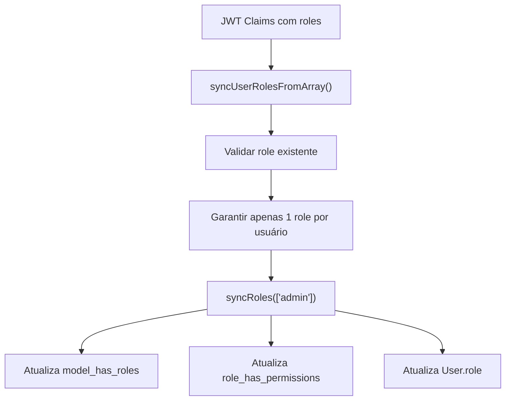
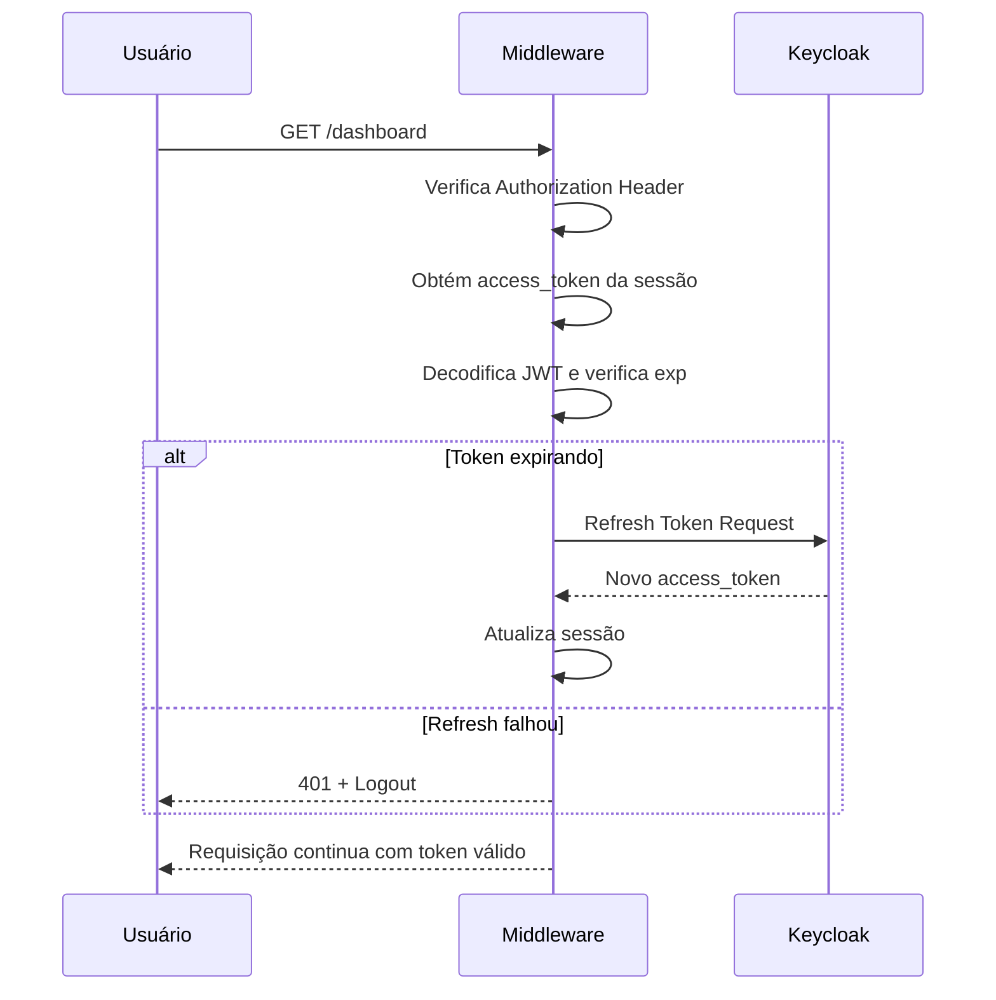
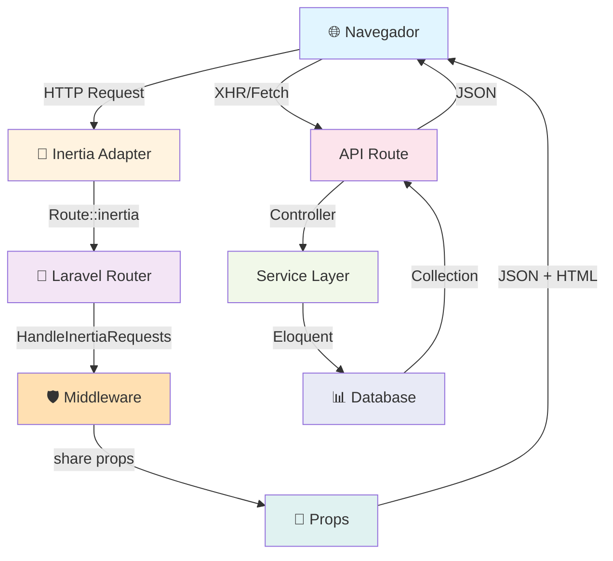

# 🔐 Larakey - Autenticação Enterprise com Keycloak 26

> Uma arquitetura robusta de autenticação e autorização integrando **Keycloak 26**, **Laravel 13**, **Vue.js 3** com **Inertia.js** e **Spatie Permissions**, demonstrando padrões de segurança em nível enterprise.

## 📋 Visão Geral do Projeto

**Larakey** é uma aplicação full-stack que implementa um sistema completo de autenticação e autorização combinando as melhores práticas de segurança moderna com padrões arquiteturais sólidos.

### 🎯 Objetivos Principais

- ✅ **Autenticação Centralizada** via Keycloak 26 (OAuth 2.0 + OpenID Connect)
- ✅ **Autorização Granular** com Spatie Laravel Permissions (RBAC)
- ✅ **Integração Seamless** Backend ↔ Frontend via Inertia.js
- ✅ **Segurança em Camadas** com múltiplos pontos de validação
- ✅ **Sincronização Bidirecional** Keycloak ↔ Database Local
- ✅ **TypeScript + Tipagem Forte** em toda a stack
- ✅ **Componentes Reutilizáveis** com shadcn-vue

---

## 🛠️ Stack Tecnológico

### Backend

| Tecnologia                 | Versão           | Propósito                            |
| -------------------------- | ---------------- | ------------------------------------ |
| **Laravel**                | 13.x             | Framework web + ORM (Eloquent)       |
| **PHP**                    | 8.3+             | Linguagem do servidor                |
| **PostgreSQL**             | 14+              | Banco de dados principal             |
| **Keycloak**               | 26               | Identity Provider (OAuth 2.0 + OIDC) |
| **Laravel Socialite**      | Latest           | Provider OAuth para Keycloak         |
| **Laravel Keycloak Guard** | robsontenorio/\* | Guard authentication customizado     |
| **Spatie Permission**      | Latest           | RBAC (Role-Based Access Control)     |

### Frontend

| Tecnologia       | Versão | Propósito                          |
| ---------------- | ------ | ---------------------------------- |
| **Vue.js**       | 3.x    | Framework reativo                  |
| **TypeScript**   | 5.x    | Tipagem estática                   |
| **Inertia.js**   | Latest | SSR bridge (Server-side rendering) |
| **shadcn-vue**   | Latest | Componentes UI reutilizáveis       |
| **Tailwind CSS** | 4.x    | Utility-first styling              |
| **Vite**         | Latest | Build tool moderno                 |

### Infraestrutura

| Componente         | Versão | Propósito                         |
| ------------------ | ------ | --------------------------------- |
| **Podman**         | Latest | Container runtime                 |
| **Docker Compose** | Latest | Orquestração de serviços          |
| **Nginx**          | 1.25+  | Reverse proxy + Web server        |
| **PHP-FPM**        | 8.3+   | FastCGI process manager           |
| **PostgreSQL**     | 14+    | Database principal + Cache tables |

### DevOps & Testing

| Ferramenta   | Versão | Propósito                     |
| ------------ | ------ | ----------------------------- |
| **PestPHP**  | Latest | Testing framework             |
| **PHPUnit**  | Latest | Unit testing                  |
| **ESLint**   | Latest | Linting JavaScript/TypeScript |
| **Pint**     | Latest | Code formatter PHP            |
| **Composer** | Latest | Gerenciador de pacotes PHP    |
| **pnpm**     | Latest | Gerenciador de pacotes Node   |

---

## 🔒 Arquitetura de Segurança

### Fluxo Completo de Autenticação



### 1️⃣ Camada 1: Keycloak OAuth 2.0 (Authorization Code)

**Protocolo:** OAuth 2.0 + OpenID Connect  
**Algorithm:** RS256 (RSA-2048 assimétrico)  
**Token TTL:** Configurável (padrão 300s)



**Código Implementado:**

```php
// routes/web.php
Route::get('/login/keycloak', [AuthController::class, 'redirect'])
    ->name('login.keycloak');
Route::get('/auth/callback', [AuthController::class, 'callback']);

// app/Http/Controllers/AuthController.php
public function redirect()
{
    return inertia()->location(
        $this->keycloakAuthService->getKeycloakRedirectUrl()
    );
}

public function callback()
{
    try {
        $this->keycloakAuthService->handleKeycloakCallback();
        return redirect()->intended('/dashboard');
    } catch (\Exception $e) {
        return redirect('/')
            ->withErrors(['error' => 'Failed to authenticate: ' . $e->getMessage()]);
    }
}
```

### 2️⃣ Camada 2: Socialite + Guard Customizado

**Propósito:** Abstrair complexidade OAuth, converter JWT em User model  
**Guard:** `robsontenorio/laravel-keycloak-guard`

```php
// config/auth.php
'guards' => [
    'web' => ['driver' => 'session', 'provider' => 'users'],
    'api' => ['driver' => 'keycloak', 'provider' => 'users'],
    'external' => ['driver' => 'keycloak', 'provider' => 'users'],
],

'providers' => [
    'users' => [
        'driver' => 'eloquent',
        'model' => User::class,
    ],
],

// config/keycloak.php
'realm_public_key' => env('KEYCLOAK_REALM_PUBLIC_KEY'),
'token_encryption_algorithm' => 'RS256', // Assimétrico > HS256
'load_user_from_database' => true,
'token_principal_attribute' => 'preferred_username',
'leeway' => 0, // Sem margem (sincronizado com NTP)
```

**Fluxo Interno:**

```
Socialite::driver('keycloak')->user()
    ↓
1. Decoda JWT header.payload.signature
2. Valida assinatura com realm_public_key
3. Verifica exp (expiration)
4. Verifica aud (audience)
5. Retorna User Laravel
```

### 3️⃣ Camada 3: Sincronização Bidirecional (Keycloak ↔ DB)

**Garantia:** Fonte única de verdade em Keycloak, cache local em DB



**Modelo Local:**

```php
// app/Models/User.php
#[Fillable(['username', 'email', 'first_name', 'last_name', 'password', 'keycloak_id', 'role', 'enabled'])]
#[Hidden(['password', 'remember_token'])]
#[Appends(['full_name'])]
#[Casts(['role' => RoleEnum::class, 'enabled' => 'boolean'])]
class User extends Authenticatable
{
    use HasFactory, Notifiable, HasRoles, SoftDeletes;

    protected function fullName(): Attribute
    {
        return Attribute::make(
            get: fn() => trim("{$this->first_name} {$this->last_name}")
        );
    }
}
```

### 4️⃣ Camada 4: Autorização (Spatie RBAC)

**Padrão:** Role-Based Access Control com Permissions granulares  
**1 Usuário = 1 Role** (regra de negócio)



**Permissões por Role:**

```
admin
  ├─ view_dashboard ✅
  ├─ manage_users ✅
  ├─ create_properties ✅
  ├─ edit_properties ✅
  ├─ delete_properties ✅
  └─ view_reports ✅

manager
  ├─ view_dashboard ✅
  ├─ create_properties ✅
  ├─ edit_properties ✅
  └─ view_reports ✅

user
  └─ view_dashboard ✅
```

**Middleware em Rotas:**

```php
// routes/web.php
Route::middleware(['auth', 'verified'])->group(function () {
    Route::inertia('dashboard', 'Dashboard')
        ->middleware('permission:view_dashboard')  // ← Spatie middleware
        ->name('dashboard');
});
```

### 5️⃣ Camada 5: Token Refresh Automático

**Propósito:** Manter sessão ativa sem re-autenticação  
**Middleware:** `InjectKeycloakToken`



**Código:**

```php
// app/Http/Middleware/InjectKeycloakToken.php
public function handle(Request $request, Closure $next): Response
{
    if (!$request->bearerToken() && $request->session()->has('access_token')) {
        $token = $request->session()->get('access_token');
        $payload = json_decode(
            base64_decode(explode('.', $token)[1] ?? '')
        );

        // Renovar se expira em menos de 10s
        if ($payload && isset($payload->exp) && time() >= ($payload->exp - 10)) {
            $newTokens = $this->keycloakService->refreshAccessToken(
                $request->session()->get('refresh_token')
            );

            if ($newTokens) {
                $token = $newTokens['access_token'];
            } else {
                $request->session()->flush();
                Auth::logout();
                return response()->json(
                    ['message' => 'Session expired. Please login again.'],
                    401
                );
            }
        }

        $request->headers->set('Authorization', "Bearer $token");
    }

    return $next($request);
}
```

### 6️⃣ Camada 6: Injeção de Autorização em Props (Inertia)

**Propósito:** Frontend conhece roles/permissions sem requisições adicionais

```php
// app/Http/Middleware/HandleInertiaRequests.php
public function share(Request $request): array
{
    $user = $request->user();

    return [
        'auth' => [
            'user' => $user,
            'roles' => $user ? $user->getRoleNames() : [],
            'permissions' => $user ? $user->getAllPermissions()->pluck('name') : [],
        ],
        'sidebarOpen' => !$request->hasCookie('sidebar_state'),
    ];
}
```

**Frontend Vue.js:**

```vue
<script setup lang="ts">
import { usePage } from '@inertiajs/vue3';

const { auth } = usePage().props;

const canManageUsers = computed(() =>
    auth.permissions.includes('manage_users'),
);
</script>

<template>
    <button
        v-if="canManageUsers"
        @click="openUserPanel"
    >
        Gerenciar Usuários
    </button>
</template>
```

---

## 🏗️ Padrões e Boas Práticas Adotadas

### 1️⃣ Service Layer (Separação de Responsabilidades)

```
app/Services/
├── KeycloakAuthService.php      → Fluxo de autenticação
├── KeycloakUserService.php      → CRUD Keycloak + DB
├── UserService.php              → Orquestração de negócio
└── Traits/KeycloakCommonTrait.php → Utilitários compartilhados
```

**Benefício:** Controllers finos, lógica testável e reutilizável

```php
// ✅ Controller responsável apenas por HTTP
class UserController
{
    public function __construct(
        private KeycloakUserService $keycloakUserService,
        private UserService $userService
    ) {}

    public function store(StoreUserRequest $request): JsonResponse
    {
        $user = $this->userService->create($request->validated());
        return response()->json(['user' => $user], 201);
    }
}

// ✅ Service responsável por negócio
class UserService
{
    public function create(array $data): User
    {
        return DB::transaction(function () use ($data) {
            $user = User::create([...]);
            $this->keycloakUserService->create($user);  // Sincroniza Keycloak
            return $user;
        });
    }
}
```

### 2️⃣ Form Requests com Tipagem Forte

```php
// app/Http/Requests/StoreUserRequest.php
/**
 * @property string|null $id
 * @property string $username
 * @property string $first_name
 * @property string $last_name
 * @property string $email
 * @property RoleEnum $role
 * @property bool|null $enabled
 */
class StoreUserRequest extends FormRequest
{
    public function rules(): array
    {
        return [
            'username' => [
                'required', 'string', 'max:50',
                Rule::unique('users')->ignore($this?->id),
            ],
            'email' => ['required', 'email', Rule::unique('users')],
            'role' => ['required', Rule::enum(RoleEnum::class)],
            'enabled' => ['nullable', 'boolean'],
        ];
    }
}
```

**Padrão:**

- ✅ Validação automática em todos os Controllers
- ✅ PHPDoc para IDE autocomplete
- ✅ `Rule::enum()` garante tipagem ao invés de `Rule::in(['admin', ...])`
- ✅ FormRequest valida **e** autoriza (separation of concerns)

### 3️⃣ Enum para Roles (Type-Safe)

```php
// app/Enums/RoleEnum.php
enum RoleEnum: string
{
    case ADMIN = 'admin';
    case MANAGER = 'manager';
    case USER = 'user';
}

// app/Models/User.php
#[Casts(['role' => RoleEnum::class])]
class User extends Authenticatable {}

// Uso:
$user->role = RoleEnum::ADMIN;  // ✅ IDE valida
// vs.
$user->role = 'invalid';         // ❌ IDE avisa
```

**Benefício:** Type safety em tempo de compilação (com PHPStan)

### 4️⃣ Injeção de Dependência

```php
// ✅ Constructor Injection (recomendado)
class UserController
{
    public function __construct(
        private KeycloakUserService $keycloak,
        private UserService $users
    ) {}
}

// Razão:
// 1. Dependencies explícitas no tipo
// 2. Fácil mockar em testes
// 3. Sem service locator anti-pattern
// 4. Refactoring automático em IDEs
```

### 5️⃣ Transações para Consistência de Dados

```php
// ✅ Sincronização Keycloak ↔ DB atômica
return DB::transaction(function () {
    // 1. Criar user no BD
    $user = User::create($data);

    // 2. Criar user no Keycloak
    $this->keycloakUserService->create($user);

    // Se KeycloakUserService lançar exception:
    // - User::create() é revertido
    // - Exception propagada
    // - Nenhum órfão no sistema

    return $user;
});
```

### 6️⃣ Model Attributes (PHP 8 Modern Syntax)

```php
// ✅ Declarativo e seguro
#[Fillable(['username', 'email', ...])]        // Whitelist
#[Hidden(['password', 'remember_token'])]      // Nunca serializar
#[Appends(['full_name'])]                      // Incluir sempre
#[Casts(['role' => RoleEnum::class, ...])]     // Type casting

// vs. antigo (mas ainda funciona):
protected $fillable = [...];
protected $hidden = [...];
protected $appends = [...];
```

### 7️⃣ Soft Deletes para Auditoria

```php
// app/Models/User.php
use SoftDeletes;

// $user->delete() → marcado como deleted_at
// Dados nunca perdidos, apenas "lixo"
// Queries automaticamente excluem soft-deleted
```

### 8️⃣ Protection contra Mass Assignment

```
Camada 1: Model #[Fillable]
  └─ Apenas campos whitelist podem ser atribuídos

Camada 2: FormRequest rules()
  └─ Apenas campos validados são aceitos

Camada 3: Controller->only()
  └─ Apenas campos não-sensíveis são retornados

// Exemplo:
$user->only([
    'id', 'email', 'username', 'role', 'created_at'
    // ❌ password e remember_token automaticamente excluídos
]);
```

### 9️⃣ TypeScript no Frontend (Vue 3)

```vue
<script setup lang="ts">
import { ref, computed } from 'vue';
import type { User } from '@/types/models';

interface Props {
    user: User;
    isLoading: boolean;
}

const props = withDefaults(defineProps<Props>(), {
    isLoading: false,
});

const fullName = computed<string>(
    () => `${props.user.firstName} ${props.user.lastName}`,
);
</script>
```

**Benefício:** Type checking em tempo de desenvolvimento, autocomplete

### 🔟 Componentes Isolados com shadcn-vue

```vue
<!-- ✅ Componente reutilizável, isolado, testável -->
<script setup lang="ts">
import { Button } from '@/components/ui/button';
import { Input } from '@/components/ui/input';
</script>

<template>
    <form @submit.prevent="onSubmit">
        <Input
            v-model="form.email"
            type="email"
            placeholder="Email"
        />
        <Button
            type="submit"
            :disabled="form.processing"
        >
            {{ form.processing ? 'Enviando...' : 'Enviar' }}
        </Button>
    </form>
</template>
```

---

## 📊 Fluxo de Dados (Inertia.js SSR)

### Arquitetura Inertia



### Fluxo de Requisição (Página com Dados)

```
1. Usuário acessa GET /users
   ↓
2. Router: Route::get('/users', [UserController::class, 'index'])
   ↓
3. UserController::index()
   └─ return Inertia::render('user/Index')

4. HandleInertiaRequests Middleware
   └─ share([
       'auth' => [
         'user' => $user,
         'roles' => $user->getRoleNames(),
         'permissions' => $user->getAllPermissions()->pluck('name')
       ]
     ])

5. Inertia prepara payload:
   {
     component: 'user/Index',
     props: {
       auth: {...},
       users: []  // ← Vazio, frontend requisita
     },
     url: '/users'
   }

6. Retorna HTML + JavaScript inicializado
   └─ Monta Vue app com props

7. Frontend inicializado, usa Inertia Link para navegação
   └─ GET /api/users?page=1&search=...

8. UserController::list()
   └─ return response()->json(
       $this->userService->getPaginated(...)
     )

9. Response: {data: [...], total: 100, per_page: 15}

10. Vue reactivo re-renderiza com dados
```

### Exemplo Prático: Criar Usuário

```
Frontend (Vue 3 + Inertia):
┌────────────────────────────────┐
│ <Form @submit="onSubmit">      │
│   <Input v-model="form.email"/ │
│   <Button type="submit">       │
│ </Form>                        │
└────────────────────────────────┘
        ↓
        POST /api/users {email, username, ...}

Backend (Laravel):
┌────────────────────────────────┐
│ Route::post('/users', ...)      │
│ → UserController::store()       │
└────────────────────────────────┘
        ↓
        StoreUserRequest valida dados
        ↓
┌────────────────────────────────┐
│ DB::transaction():              │
│   1. User::create($validated)   │
│   2. Keycloak::create($user)    │
│   3. syncRoles()                │
└────────────────────────────────┘
        ↓
        Response: 201 {message, user}

Frontend:
┌────────────────────────────────┐
│ form.post('/api/users')         │
│   .then(() => {                 │
│     showSuccess('Criado!')      │
│     router.visit('/users')      │
│   })                            │
└────────────────────────────────┘
```

---

## 🔐 Configuração do Keycloak 26

### 📌 Pré-Requisitos

- Keycloak 26 rodando (via Podman/Docker)
- Acesso admin ao Keycloak (`http://localhost:8080`)
- Client credentials configuradas em `.env`

### 🔧 Passos de Configuração

#### 1️⃣ Criar Realm

```
Admin Console → Realms → Create Realm
├─ Name: larakey-realm
├─ Enabled: ON
└─ Save
```

#### 2️⃣ Criar Client OAuth 2.0

```
Realm: larakey-realm → Clients → Create Client
├─ Client ID: larakey
├─ Client type: OpenID Connect
├─ Next
├─ Client authentication: ON (confidential)
├─ Authorization: OFF (não precisa policy engine)
├─ Next
│
├─ Valid redirect URIs:
│   http://localhost:3000/auth/callback
│   http://localhost/auth/callback
│   https://seu-dominio.com/auth/callback
│
├─ Web origins:
│   http://localhost:3000
│   http://localhost
│   https://seu-dominio.com
│
└─ Save
```

#### 3️⃣ Configurar Client Secret

```
Clients → larakey → Credentials
├─ Client Secret: [gerado automaticamente]
├─ Copiar value → .env (KEYCLOAK_CLIENT_SECRET)
└─ Save
```

#### 4️⃣ Obter Realm Public Key

```
Realms → larakey-realm → Keys → RS256 (Active)
├─ Certificate: [PEM format]
├─ Copiar conteúdo completo
├─ .env: KEYCLOAK_REALM_PUBLIC_KEY="-----BEGIN CERTIFICATE-----\n...\n-----END CERTIFICATE-----"
└─ Save
```

**Formato correto (.env):**

```bash
KEYCLOAK_REALM_PUBLIC_KEY="-----BEGIN CERTIFICATE-----
MIICnTCCAYUCBgF5xKR1lTANBgkqhkiG9w0BAQsFADASMRAwDgYDVQQDDAdsYXJh
...
-----END CERTIFICATE-----"
```

#### 5️⃣ Criar Roles do Cliente

```
Clients → larakey → Roles → Create Role
├─ Role 1: admin
├─ Role 2: manager
├─ Role 3: user
└─ Save each

Clients → larakey → Scope → add-on-token.roles
├─ Include in token scope: ON
├─ Protocol: openid-connect
└─ Save
```

#### 6️⃣ Configurar Token Mapper (Roles em JWT)

```
Clients → larakey → Client Scopes
├─ roles → Mappers → [check if exists] "client roles"

If não existe, criar:
Mappers → Create → Client Roles
├─ Name: client roles
├─ Protocol: openid-connect
├─ Mapper Type: User Client Role
├─ Token Claim Name: resource_access.${client_id}.roles
├─ Add to access token: ON
├─ Add to ID token: OFF
├─ Save
```

#### 7️⃣ Criar Usuários de Teste

```
Users → Create user
├─ Username: admin@example.com
├─ Email: admin@example.com
├─ First Name: Admin
├─ Last Name: User
├─ Email Verified: ON
├─ Enabled: ON
├─ Next

Set Password:
├─ Password: [gerada randomicamente]
├─ Temporary: ON (força mudança no primeiro login)
└─ Save
```

#### 8️⃣ Atribuir Client Roles aos Usuários

```
Users → admin@example.com → Role mapping
├─ Client Roles: larakey
├─ Available Roles:
│   ├─ ☑ admin
│   ├─ ☑ manager
│   └─ ☑ user
├─ Assign
└─ Save
```

**Nota:** Atribuir **apenas 1 role** por usuário (regra de negócio Larakey)

#### 9️⃣ Configurar Keycloak Admin API (Para CRUD)

```
Clients → larakey → Service Accounts Roles
├─ Client Roles: realm-management
├─ Available Roles:
│   ├─ ☑ manage-users
│   ├─ ☑ manage-realm
│   ├─ ☑ view-clients
│   └─ ☑ manage-clients
├─ Assign
└─ Save
```

Isso permite que a aplicação:

- ✅ Criar usuários em Keycloak
- ✅ Atualizar usuários em Keycloak
- ✅ Deletar usuários em Keycloak
- ✅ Atribuir/remover roles

#### 🔟 Configurar User Federation (Opcional - Active Directory)

```
Realms → larakey-realm → User Federation → Add provider
├─ kerberos / ldap / custom
├─ [... configure conforme seu AD]
└─ Save
```

### 📝 Variáveis de Ambiente Keycloak

```bash
# .env

# Keycloak OAuth 2.0
KEYCLOAK_BASE_URL=http://localhost:8080
KEYCLOAK_REALM=larakey-realm
KEYCLOAK_CLIENT_ID=larakey
KEYCLOAK_CLIENT_SECRET=kV1s9xXl2Rt7wPq4nZuY6mK3jFh8bCd5eOp0aGj1
KEYCLOAK_REDIRECT_URI=http://localhost:3000/auth/callback

# JWT Token
KEYCLOAK_REALM_PUBLIC_KEY="-----BEGIN CERTIFICATE-----\n...\n-----END CERTIFICATE-----"
KEYCLOAK_TOKEN_ENCRYPTION_ALGORITHM=RS256

# Comportamento
KEYCLOAK_LOAD_USER_FROM_DATABASE=true
KEYCLOAK_USER_PROVIDER_CREDENTIAL=username
KEYCLOAK_TOKEN_PRINCIPAL_ATTRIBUTE=preferred_username
KEYCLOAK_APPEND_DECODED_TOKEN=false
KEYCLOAK_LEEWAY=0

# Segurança
KEYCLOAK_IGNORE_RESOURCES_VALIDATION=false
```

### ✅ Validação da Configuração

```bash
# 1. Testar conexão com Keycloak
curl -X GET \
  "http://localhost:8080/realms/larakey-realm/.well-known/openid-configuration" \
  | jq .

# 2. Obter Admin Token
curl -X POST \
  "http://localhost:8080/realms/larakey-realm/protocol/openid-connect/token" \
  -H "Content-Type: application/x-www-form-urlencoded" \
  -d "client_id=larakey&client_secret=YOUR_SECRET&grant_type=client_credentials" \
  | jq .

# 3. Listar Usuários (com admin token)
curl -X GET \
  "http://localhost:8080/admin/realms/larakey-realm/users" \
  -H "Authorization: Bearer $ADMIN_TOKEN" \
  | jq .

# 4. Testar OAuth Flow (login)
# Acessar: http://localhost:3000/login/keycloak
# Deve redirecionar para Keycloak → validar credenciais → callback
```

---

## 🚀 Instruções de Configuração Local

### 📋 Pré-Requisitos

- **PHP 8.3+**
- **Node.js 18+** com pnpm
- **Podman** ou Docker
- **Git**
- **Composer**

### ⚙️ Setup Completo

#### 1️⃣ Clonar Repositório

```bash
git clone https://github.com/romariotech/larakey.git
cd larakey
```

#### 2️⃣ Instalar Dependências Backend

```bash
# Instalar pacotes PHP
composer install

# Gerar APP_KEY
php artisan key:generate

# Publicar config (se necessário)
php artisan config:publish
```

#### 3️⃣ Instalar Dependências Frontend

```bash
# Instalar pacotes Node
npm install

# Build assets (Vite)
npm run build

# ou development com HMR
npm run dev
```

#### 4️⃣ Configurar Variáveis de Ambiente

```bash
# Copiar exemplo
cp .env.example .env

# Editar .env com valores locais
nano .env
```

**Valores Essenciais:**

```bash
APP_NAME=Larakey
APP_KEY=base64:xxxxx  # gerado em Step 2
APP_DEBUG=true
APP_URL=http://localhost

# Database
DB_CONNECTION=pgsql
DB_HOST=127.0.0.1
DB_PORT=5432
DB_DATABASE=larakey
DB_USERNAME=postgres
DB_PASSWORD=password

# Keycloak (ajustar conforme seu setup)
KEYCLOAK_BASE_URL=http://localhost:8080
KEYCLOAK_REALM=larakey-realm
KEYCLOAK_CLIENT_ID=larakey
KEYCLOAK_CLIENT_SECRET=xxx
KEYCLOAK_REDIRECT_URI=http://localhost:3000/auth/callback
```

#### 5️⃣ Subir Containers (Podman/Docker)

```bash
# Iniciar serviços (PostgreSQL, Redis, Keycloak, Nginx, PHP-FPM)
docker-compose up -d

# Ou com Podman
podman-compose up -d

# Verificar status
docker-compose ps
```

#### 6️⃣ Executar Migrations

```bash
# Criar tabelas
php artisan migrate

# Seed (criar roles e permissions)
php artisan db:seed --class=RolesAndPermissionsSeeder
```

#### 7️⃣ Compilar Frontend

```bash
# Development
npm run dev

# Production
npm run build
```

#### 8️⃣ Acessar Aplicação

```
🌐 http://localhost:3000
🔐 Login: /login/keycloak
📊 Dashboard: /dashboard (após autenticado)
```

### 🧪 Testar Fluxo Completo

```bash
# 1. Acessar home
curl http://localhost:3000/

# 2. Clicar em "Login com Keycloak" (na interface)
# → Será redirecionado para Keycloak

# 3. Autenticar com usuário criado em Keycloak
# → Callback para http://localhost:3000/auth/callback?code=...

# 4. Acessar dashboard autenticado
curl -b cookies.txt http://localhost:3000/dashboard

# 5. Testar API com token
curl -H "Authorization: Bearer $ACCESS_TOKEN" \
  http://localhost:3000/api/users
```

### 📦 Comando Rápido (Docker Compose)

```bash
# All-in-one
docker-compose up -d && \
php artisan migrate && \
php artisan db:seed --class=RolesAndPermissionsSeeder && \
pnpm install && \
pnpm run build

# Pronto! Acesse http://localhost:3000
```

### 🛠️ Troubleshooting

| Problema                    | Solução                                                    |
| --------------------------- | ---------------------------------------------------------- |
| **Token inválido/expirado** | Verificar `KEYCLOAK_REALM_PUBLIC_KEY` e sincronizar NTP    |
| **Redirect loop**           | Validar `KEYCLOAK_REDIRECT_URI` em ambos Keycloak e `.env` |
| **User não sincronizado**   | Verificar `KEYCLOAK_LOAD_USER_FROM_DATABASE=true`          |
| **Permission denied**       | Validar roles atribuído a usuário em Keycloak              |
| **CORS error**              | Adicionar origem em Keycloak Client → Web origins          |

---

## 🔍 Boas Práticas de Segurança Implementadas

### ✅ Autenticação

- ✅ **RS256 (RSA-2048)** ao invés de HS256 (assimétrico)
- ✅ **Token Refresh automático** com margem de segurança (10s)
- ✅ **Session regeneration** no logout
- ✅ **CSRF protection** integrada (Inertia + Laravel)
- ✅ **Secure cookies** com HttpOnly, SameSite flags

### ✅ Autorização

- ✅ **RBAC** com Spatie (Role-Based Access Control)
- ✅ **Permissões granulares** por action/resource
- ✅ **Middleware de rota** `permission:action`
- ✅ **Frontend validation** preventiva (UX + segurança)
- ✅ **Backend validation** obrigatória (segurança)

### ✅ Dados

- ✅ **Mass assignment protection** (Model #[Fillable])
- ✅ **Hidden attributes** (password, tokens)
- ✅ **Form Request validation** + type casting
- ✅ **Prepared statements** (Eloquent ORM previne SQL injection)
- ✅ **Soft deletes** para auditoria

### ✅ API

- ✅ **Input validation** em todos endpoints
- ✅ **Rate limiting** (configurável)
- ✅ **CORS** restritivo
- ✅ **API token rotation** automático
- ✅ **Error messages** genéricas (não vaza info sensível)

### ✅ Infraestrutura

- ✅ **Keycloak isolated** em container
- ✅ **Database isolated** (sem acesso direto, cache em tabelas)
- ✅ **Cache em Database** (sem dependência externa)
- ✅ **Nginx reverse proxy** com security headers
- ✅ **PHP-FPM** isolated user

---

## 📚 Documentação Adicional

- [Keycloak Official Docs](https://www.keycloak.org/documentation.html)
- [Laravel 13 Auth Docs](https://laravel.com/docs/13.x/authentication)
- [Spatie Permission Docs](https://spatie.be/docs/laravel-permission)
- [Inertia.js Docs](https://inertiajs.com)
- [OAuth 2.0 RFC 6749](https://tools.ietf.org/html/rfc6749)

---

## 📄 Licença

Este projeto é licenciado sob MIT License - veja arquivo [LICENSE](LICENSE) para detalhes.

---

## 👨‍💻 Autor

**Romário Tech**  
GitHub: [@romariotech](https://github.com/romariotech)
